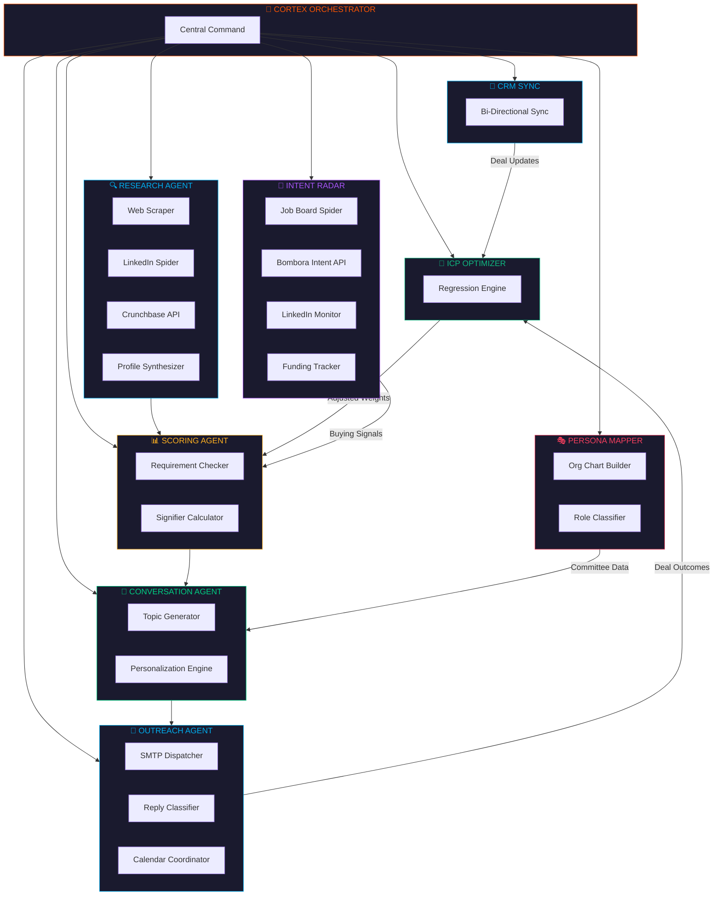
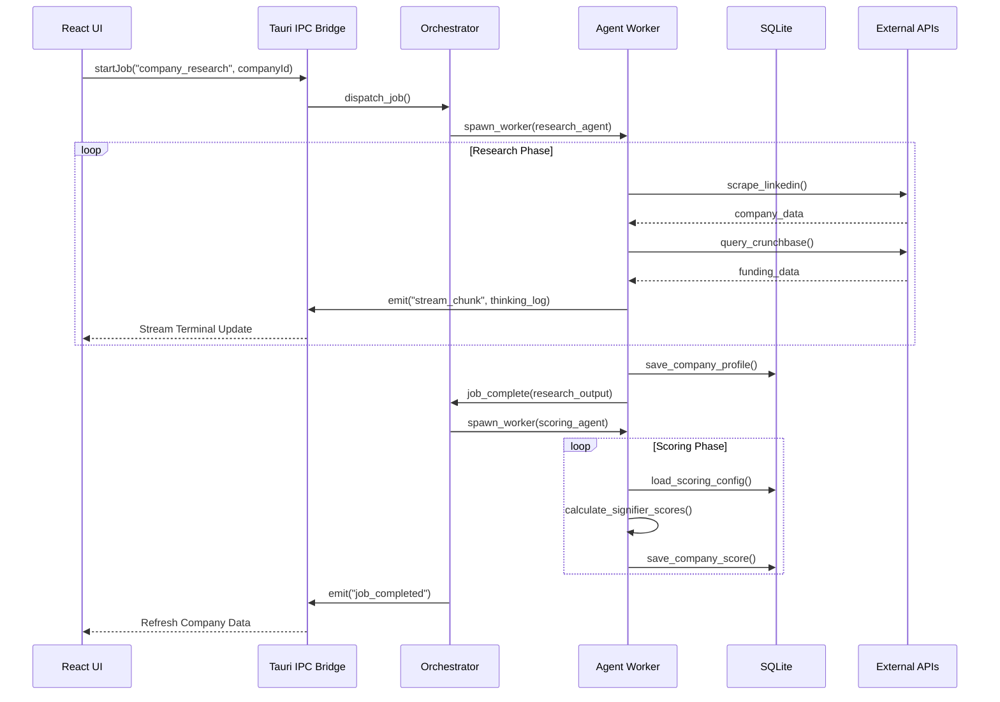

<div align="center">

<!-- Animated SVG Header -->
<svg xmlns="http://www.w3.org/2000/svg" viewBox="0 0 800 200" width="800" height="200">
  <defs>
    <linearGradient id="grad1" x1="0%" y1="0%" x2="100%" y2="0%">
      <stop offset="0%" style="stop-color:#FF5500;stop-opacity:1">
        <animate attributeName="stop-color" values="#FF5500;#FF8C00;#FF5500" dur="3s" repeatCount="indefinite"/>
      </stop>
      <stop offset="100%" style="stop-color:#FF8C00;stop-opacity:1">
        <animate attributeName="stop-color" values="#FF8C00;#FF5500;#FF8C00" dur="3s" repeatCount="indefinite"/>
      </stop>
    </linearGradient>
    <filter id="glow">
      <feGaussianBlur stdDeviation="3" result="coloredBlur"/>
      <feMerge>
        <feMergeNode in="coloredBlur"/>
        <feMergeNode in="SourceGraphic"/>
      </feMerge>
    </filter>
    <filter id="softGlow">
      <feGaussianBlur stdDeviation="2" result="blur"/>
      <feMerge>
        <feMergeNode in="blur"/>
        <feMergeNode in="SourceGraphic"/>
      </feMerge>
    </filter>
  </defs>
  
  <!-- Background -->
  <rect width="800" height="200" rx="16" fill="#0A0A0F"/>
  
  <!-- Animated grid lines -->
  <g opacity="0.08">
    <line x1="0" y1="50" x2="800" y2="50" stroke="#FF5500" stroke-width="0.5">
      <animate attributeName="opacity" values="0.3;0.8;0.3" dur="4s" repeatCount="indefinite"/>
    </line>
    <line x1="0" y1="100" x2="800" y2="100" stroke="#FF5500" stroke-width="0.5">
      <animate attributeName="opacity" values="0.5;1;0.5" dur="3s" repeatCount="indefinite"/>
    </line>
    <line x1="0" y1="150" x2="800" y2="150" stroke="#FF5500" stroke-width="0.5">
      <animate attributeName="opacity" values="0.3;0.8;0.3" dur="5s" repeatCount="indefinite"/>
    </line>
    <line x1="200" y1="0" x2="200" y2="200" stroke="#FF5500" stroke-width="0.5">
      <animate attributeName="opacity" values="0.2;0.6;0.2" dur="4s" repeatCount="indefinite"/>
    </line>
    <line x1="400" y1="0" x2="400" y2="200" stroke="#FF5500" stroke-width="0.5">
      <animate attributeName="opacity" values="0.4;0.9;0.4" dur="3s" repeatCount="indefinite"/>
    </line>
    <line x1="600" y1="0" x2="600" y2="200" stroke="#FF5500" stroke-width="0.5">
      <animate attributeName="opacity" values="0.2;0.6;0.2" dur="5s" repeatCount="indefinite"/>
    </line>
  </g>

  <!-- Animated particles -->
  <circle cx="100" cy="50" r="2" fill="#FF5500" opacity="0.6">
    <animate attributeName="cx" values="100;700;100" dur="8s" repeatCount="indefinite"/>
    <animate attributeName="cy" values="50;150;50" dur="6s" repeatCount="indefinite"/>
    <animate attributeName="opacity" values="0.2;0.8;0.2" dur="3s" repeatCount="indefinite"/>
  </circle>
  <circle cx="300" cy="150" r="1.5" fill="#00AEEF" opacity="0.4">
    <animate attributeName="cx" values="300;600;300" dur="10s" repeatCount="indefinite"/>
    <animate attributeName="cy" values="150;30;150" dur="7s" repeatCount="indefinite"/>
    <animate attributeName="opacity" values="0.1;0.6;0.1" dur="4s" repeatCount="indefinite"/>
  </circle>
  <circle cx="600" cy="80" r="1" fill="#00D084" opacity="0.5">
    <animate attributeName="cx" values="600;200;600" dur="9s" repeatCount="indefinite"/>
    <animate attributeName="cy" values="80;170;80" dur="5s" repeatCount="indefinite"/>
  </circle>
  
  <!-- Neural network nodes -->
  <g filter="url(#softGlow)">
    <circle cx="120" cy="100" r="4" fill="#FF5500" opacity="0.8">
      <animate attributeName="r" values="3;5;3" dur="2s" repeatCount="indefinite"/>
    </circle>
    <circle cx="680" cy="100" r="4" fill="#FF5500" opacity="0.8">
      <animate attributeName="r" values="4;6;4" dur="2.5s" repeatCount="indefinite"/>
    </circle>
    <line x1="124" y1="100" x2="676" y2="100" stroke="url(#grad1)" stroke-width="1" opacity="0.3" stroke-dasharray="8 4">
      <animate attributeName="stroke-dashoffset" values="0;24" dur="2s" repeatCount="indefinite"/>
    </line>
  </g>

  <!-- Main Title -->
  <text x="400" y="85" text-anchor="middle" font-family="'SF Pro Display', 'Inter', system-ui, sans-serif" font-size="48" font-weight="800" fill="url(#grad1)" filter="url(#glow)" letter-spacing="-2">
    CortexOS
  </text>
  
  <!-- Subtitle -->
  <text x="400" y="120" text-anchor="middle" font-family="'SF Mono', 'JetBrains Mono', monospace" font-size="14" fill="#888" letter-spacing="4">
    AUTONOMOUS GTM ORCHESTRATION ENGINE
  </text>
  
  <!-- Animated status bar -->
  <rect x="280" y="145" width="240" height="24" rx="12" fill="#1A1A2E" stroke="#FF5500" stroke-width="0.5" opacity="0.8"/>
  <circle cx="298" cy="157" r="4" fill="#00D084">
    <animate attributeName="opacity" values="0.4;1;0.4" dur="1.5s" repeatCount="indefinite"/>
  </circle>
  <text x="312" y="162" font-family="'SF Mono', monospace" font-size="11" fill="#00D084" letter-spacing="1">
    8 AGENTS ONLINE • v0.2.1
  </text>
</svg>

<br/>

<p>
  
  
  
  
  
  
</p>

<p>
  <strong>Replace your entire SDR team with autonomous AI agent swarms.</strong><br/>
  <sub>CortexOS is a desktop-native GTM intelligence platform that researches, scores, personalizes, and executes outbound — autonomously.</sub>
</p>

<br/>

[Features](#-features) · [Architecture](#-architecture) · [Quick Start](#-quick-start) · [Agent Swarm](#-the-agent-swarm) · [Pages](#-pages) · [Tech Stack](#-tech-stack) · [Roadmap](#-roadmap)

</div>

---

<br/>

## ⚡ What is CortexOS?

CortexOS is a **fully autonomous Go-To-Market operating system** built as a native desktop app. It deploys a swarm of specialized AI agents that work in concert to:

1. **Discover** target accounts from any data source
2. **Research** each company deeply via web scraping and LLM analysis
3. **Score** every account against your Ideal Customer Profile (ICP)
4. **Map** buying committees and assign persona-level roles
5. **Generate** hyper-personalized conversation starters
6. **Execute** multi-step outreach sequences autonomously
7. **Learn** from outcomes to continuously tune scoring weights
8. **Sync** everything bi-directionally with your CRM

> **Zero manual prospecting. Zero copy-paste. Zero SDR headcount.**

<br/>

---

## 🧠 Architecture

<!-- Animated SVG Architecture Diagram -->
<div align="center">

<svg xmlns="http://www.w3.org/2000/svg" viewBox="0 0 900 620" width="900" height="620">
  <defs>
    <linearGradient id="archGrad" x1="0%" y1="0%" x2="100%" y2="100%">
      <stop offset="0%" style="stop-color:#FF5500;stop-opacity:0.8"/>
      <stop offset="100%" style="stop-color:#FF8C00;stop-opacity:0.8"/>
    </linearGradient>
    <linearGradient id="blueGrad" x1="0%" y1="0%" x2="100%" y2="100%">
      <stop offset="0%" style="stop-color:#00AEEF;stop-opacity:0.8"/>
      <stop offset="100%" style="stop-color:#0077B6;stop-opacity:0.8"/>
    </linearGradient>
    <linearGradient id="greenGrad" x1="0%" y1="0%" x2="100%" y2="100%">
      <stop offset="0%" style="stop-color:#00D084;stop-opacity:0.8"/>
      <stop offset="100%" style="stop-color:#00A86B;stop-opacity:0.8"/>
    </linearGradient>
    <linearGradient id="purpleGrad" x1="0%" y1="0%" x2="100%" y2="100%">
      <stop offset="0%" style="stop-color:#A855F7;stop-opacity:0.8"/>
      <stop offset="100%" style="stop-color:#7C3AED;stop-opacity:0.8"/>
    </linearGradient>
    <filter id="archGlow">
      <feGaussianBlur stdDeviation="2" result="blur"/>
      <feMerge><feMergeNode in="blur"/><feMergeNode in="SourceGraphic"/></feMerge>
    </filter>
    <filter id="shadow">
      <feDropShadow dx="0" dy="2" stdDeviation="4" flood-color="#000" flood-opacity="0.3"/>
    </filter>
  </defs>
  
  <!-- Background -->
  <rect width="900" height="620" rx="16" fill="#0A0A0F"/>
  
  <!-- Subtle grid -->
  <g opacity="0.04">
    <line x1="0" y1="100" x2="900" y2="100" stroke="#fff" stroke-width="0.5"/>
    <line x1="0" y1="200" x2="900" y2="200" stroke="#fff" stroke-width="0.5"/>
    <line x1="0" y1="300" x2="900" y2="300" stroke="#fff" stroke-width="0.5"/>
    <line x1="0" y1="400" x2="900" y2="400" stroke="#fff" stroke-width="0.5"/>
    <line x1="0" y1="500" x2="900" y2="500" stroke="#fff" stroke-width="0.5"/>
    <line x1="150" y1="0" x2="150" y2="620" stroke="#fff" stroke-width="0.5"/>
    <line x1="300" y1="0" x2="300" y2="620" stroke="#fff" stroke-width="0.5"/>
    <line x1="450" y1="0" x2="450" y2="620" stroke="#fff" stroke-width="0.5"/>
    <line x1="600" y1="0" x2="600" y2="620" stroke="#fff" stroke-width="0.5"/>
    <line x1="750" y1="0" x2="750" y2="620" stroke="#fff" stroke-width="0.5"/>
  </g>

  <!-- Title -->
  <text x="450" y="38" text-anchor="middle" font-family="'SF Mono', monospace" font-size="11" fill="#666" letter-spacing="3">SYSTEM ARCHITECTURE</text>
  
  <!-- ═══════════════ LAYER 1: FRONTEND ═══════════════ -->
  <text x="60" y="80" font-family="'SF Mono', monospace" font-size="9" fill="#FF5500" letter-spacing="2" opacity="0.6">PRESENTATION LAYER</text>
  
  <!-- React Frontend Box -->
  <rect x="40" y="90" width="820" height="100" rx="12" fill="#1A1A2E" stroke="#FF5500" stroke-width="0.8" filter="url(#shadow)"/>
  <text x="65" y="115" font-family="system-ui" font-size="13" fill="#FF5500" font-weight="700">⚛ React 19 + Tailwind 4</text>
  
  <!-- Page boxes -->
  <g font-family="'SF Mono', monospace" font-size="9">
    <rect x="60" y="130" width="85" height="42" rx="6" fill="#FF5500" fill-opacity="0.1" stroke="#FF5500" stroke-width="0.5"/>
    <text x="102" y="148" text-anchor="middle" fill="#FF8C00">Dashboard</text>
    <text x="102" y="162" text-anchor="middle" fill="#666" font-size="7">KPIs + Funnel</text>
    
    <rect x="155" y="130" width="85" height="42" rx="6" fill="#FF5500" fill-opacity="0.1" stroke="#FF5500" stroke-width="0.5"/>
    <text x="197" y="148" text-anchor="middle" fill="#FF8C00">Companies</text>
    <text x="197" y="162" text-anchor="middle" fill="#666" font-size="7">Pipeline View</text>
    
    <rect x="250" y="130" width="85" height="42" rx="6" fill="#FF5500" fill-opacity="0.1" stroke="#FF5500" stroke-width="0.5"/>
    <text x="292" y="148" text-anchor="middle" fill="#FF8C00">Contacts</text>
    <text x="292" y="162" text-anchor="middle" fill="#666" font-size="7">Buying Comms</text>
    
    <rect x="345" y="130" width="85" height="42" rx="6" fill="#FF5500" fill-opacity="0.1" stroke="#FF5500" stroke-width="0.5"/>
    <text x="387" y="148" text-anchor="middle" fill="#FF8C00">Signals</text>
    <text x="387" y="162" text-anchor="middle" fill="#666" font-size="7">Intent Mesh</text>
    
    <rect x="440" y="130" width="85" height="42" rx="6" fill="#FF5500" fill-opacity="0.1" stroke="#FF5500" stroke-width="0.5"/>
    <text x="482" y="148" text-anchor="middle" fill="#FF8C00">Outreach</text>
    <text x="482" y="162" text-anchor="middle" fill="#666" font-size="7">Sequences</text>
    
    <rect x="535" y="130" width="70" height="42" rx="6" fill="#FF5500" fill-opacity="0.1" stroke="#FF5500" stroke-width="0.5"/>
    <text x="570" y="148" text-anchor="middle" fill="#FF8C00">ICP</text>
    <text x="570" y="162" text-anchor="middle" fill="#666" font-size="7">Self-Learn</text>
    
    <rect x="615" y="130" width="70" height="42" rx="6" fill="#FF5500" fill-opacity="0.1" stroke="#FF5500" stroke-width="0.5"/>
    <text x="650" y="148" text-anchor="middle" fill="#FF8C00">Flow</text>
    <text x="650" y="162" text-anchor="middle" fill="#666" font-size="7">Builder</text>
    
    <rect x="695" y="130" width="70" height="42" rx="6" fill="#FF5500" fill-opacity="0.1" stroke="#FF5500" stroke-width="0.5"/>
    <text x="730" y="148" text-anchor="middle" fill="#FF8C00">Integ</text>
    <text x="730" y="162" text-anchor="middle" fill="#666" font-size="7">CRM Sync</text>

    <rect x="775" y="130" width="70" height="42" rx="6" fill="#FF5500" fill-opacity="0.1" stroke="#FF5500" stroke-width="0.5"/>
    <text x="810" y="148" text-anchor="middle" fill="#FF8C00">Memory</text>
    <text x="810" y="162" text-anchor="middle" fill="#666" font-size="7">Graph</text>
  </g>

  <!-- ═══════════════ DATA FLOW ARROWS ═══════════════ -->
  <!-- IPC Bridge animated arrow -->
  <line x1="450" y1="190" x2="450" y2="240" stroke="#FF5500" stroke-width="1.5" stroke-dasharray="4 3">
    <animate attributeName="stroke-dashoffset" values="0;14" dur="1s" repeatCount="indefinite"/>
  </line>
  <text x="480" y="220" font-family="'SF Mono', monospace" font-size="8" fill="#FF5500" opacity="0.7">Tauri IPC</text>

  <!-- ═══════════════ LAYER 2: STATE / IPC ═══════════════ -->
  <text x="60" y="252" font-family="'SF Mono', monospace" font-size="9" fill="#00AEEF" letter-spacing="2" opacity="0.6">STATE MANAGEMENT + IPC BRIDGE</text>
  
  <rect x="40" y="260" width="820" height="70" rx="12" fill="#1A1A2E" stroke="#00AEEF" stroke-width="0.8" filter="url(#shadow)"/>
  
  <g font-family="'SF Mono', monospace" font-size="9">
    <rect x="60" y="275" width="120" height="38" rx="6" fill="#00AEEF" fill-opacity="0.08" stroke="#00AEEF" stroke-width="0.5"/>
    <text x="120" y="292" text-anchor="middle" fill="#00AEEF" font-size="10">Zustand Stores</text>
    <text x="120" y="305" text-anchor="middle" fill="#555" font-size="7">Settings · Selection · Flow</text>
    
    <rect x="200" y="275" width="140" height="38" rx="6" fill="#00AEEF" fill-opacity="0.08" stroke="#00AEEF" stroke-width="0.5"/>
    <text x="270" y="292" text-anchor="middle" fill="#00AEEF" font-size="10">TanStack Query v5</text>
    <text x="270" y="305" text-anchor="middle" fill="#555" font-size="7">Cache · Sync · Optimistic</text>
    
    <rect x="360" y="275" width="130" height="38" rx="6" fill="#00AEEF" fill-opacity="0.08" stroke="#00AEEF" stroke-width="0.5"/>
    <text x="425" y="292" text-anchor="middle" fill="#00AEEF" font-size="10">Event Bridge</text>
    <text x="425" y="305" text-anchor="middle" fill="#555" font-size="7">Tauri Events → React</text>
    
    <rect x="510" y="275" width="130" height="38" rx="6" fill="#00AEEF" fill-opacity="0.08" stroke="#00AEEF" stroke-width="0.5"/>
    <text x="575" y="292" text-anchor="middle" fill="#00AEEF" font-size="10">IPC Commands</text>
    <text x="575" y="305" text-anchor="middle" fill="#555" font-size="7">invoke() Wrappers</text>
    
    <rect x="660" y="275" width="180" height="38" rx="6" fill="#00AEEF" fill-opacity="0.08" stroke="#00AEEF" stroke-width="0.5"/>
    <text x="750" y="292" text-anchor="middle" fill="#00AEEF" font-size="10">LocalStorage Fallback</text>
    <text x="750" y="305" text-anchor="middle" fill="#555" font-size="7">Browser-mode persistence</text>
  </g>

  <!-- Arrow down -->
  <line x1="450" y1="330" x2="450" y2="370" stroke="#A855F7" stroke-width="1.5" stroke-dasharray="4 3">
    <animate attributeName="stroke-dashoffset" values="0;14" dur="1.2s" repeatCount="indefinite"/>
  </line>
  <text x="480" y="355" font-family="'SF Mono', monospace" font-size="8" fill="#A855F7" opacity="0.7">Commands</text>

  <!-- ═══════════════ LAYER 3: AGENT SWARM ═══════════════ -->
  <text x="60" y="382" font-family="'SF Mono', monospace" font-size="9" fill="#A855F7" letter-spacing="2" opacity="0.6">AGENT ORCHESTRATION LAYER</text>
  
  <rect x="40" y="390" width="820" height="90" rx="12" fill="#1A1A2E" stroke="#A855F7" stroke-width="0.8" filter="url(#shadow)"/>
  <text x="65" y="415" font-family="system-ui" font-size="13" fill="#A855F7" font-weight="700">🤖 Autonomous Agent Swarm (8 Agents)</text>
  
  <g font-family="'SF Mono', monospace" font-size="8">
    <rect x="60" y="425" width="88" height="38" rx="6" fill="#A855F7" fill-opacity="0.1" stroke="#A855F7" stroke-width="0.5"/>
    <text x="104" y="440" text-anchor="middle" fill="#C084FC">Research</text>
    <circle cx="68" cy="455" r="3" fill="#00D084"><animate attributeName="opacity" values="0.3;1;0.3" dur="1.5s" repeatCount="indefinite"/></circle>
    <text x="82" y="458" fill="#555" font-size="7">4 workers</text>
    
    <rect x="158" y="425" width="88" height="38" rx="6" fill="#A855F7" fill-opacity="0.1" stroke="#A855F7" stroke-width="0.5"/>
    <text x="202" y="440" text-anchor="middle" fill="#C084FC">Scoring</text>
    <circle cx="166" cy="455" r="3" fill="#00D084"><animate attributeName="opacity" values="0.5;1;0.5" dur="2s" repeatCount="indefinite"/></circle>
    <text x="180" y="458" fill="#555" font-size="7">2 workers</text>
    
    <rect x="256" y="425" width="88" height="38" rx="6" fill="#A855F7" fill-opacity="0.1" stroke="#A855F7" stroke-width="0.5"/>
    <text x="300" y="440" text-anchor="middle" fill="#C084FC">Conversation</text>
    <circle cx="264" cy="455" r="3" fill="#00D084"><animate attributeName="opacity" values="0.4;1;0.4" dur="1.8s" repeatCount="indefinite"/></circle>
    <text x="278" y="458" fill="#555" font-size="7">2 workers</text>
    
    <rect x="354" y="425" width="88" height="38" rx="6" fill="#A855F7" fill-opacity="0.1" stroke="#A855F7" stroke-width="0.5"/>
    <text x="398" y="440" text-anchor="middle" fill="#C084FC">Outreach</text>
    <circle cx="362" cy="455" r="3" fill="#00D084"><animate attributeName="opacity" values="0.6;1;0.6" dur="1.3s" repeatCount="indefinite"/></circle>
    <text x="376" y="458" fill="#555" font-size="7">3 workers</text>
    
    <rect x="452" y="425" width="88" height="38" rx="6" fill="#A855F7" fill-opacity="0.1" stroke="#A855F7" stroke-width="0.5"/>
    <text x="496" y="440" text-anchor="middle" fill="#C084FC">Intent Radar</text>
    <circle cx="460" cy="455" r="3" fill="#00D084"><animate attributeName="opacity" values="0.3;1;0.3" dur="2.2s" repeatCount="indefinite"/></circle>
    <text x="474" y="458" fill="#555" font-size="7">4 workers</text>
    
    <rect x="550" y="425" width="88" height="38" rx="6" fill="#A855F7" fill-opacity="0.1" stroke="#A855F7" stroke-width="0.5"/>
    <text x="594" y="440" text-anchor="middle" fill="#C084FC">Persona Map</text>
    <circle cx="558" cy="455" r="3" fill="#00D084"><animate attributeName="opacity" values="0.5;1;0.5" dur="1.6s" repeatCount="indefinite"/></circle>
    <text x="572" y="458" fill="#555" font-size="7">2 workers</text>
    
    <rect x="648" y="425" width="88" height="38" rx="6" fill="#A855F7" fill-opacity="0.1" stroke="#A855F7" stroke-width="0.5"/>
    <text x="692" y="440" text-anchor="middle" fill="#C084FC">ICP Optimizer</text>
    <circle cx="656" cy="455" r="3" fill="#FFB020"><animate attributeName="opacity" values="0.4;1;0.4" dur="1.4s" repeatCount="indefinite"/></circle>
    <text x="670" y="458" fill="#555" font-size="7">1 worker</text>
    
    <rect x="746" y="425" width="88" height="38" rx="6" fill="#A855F7" fill-opacity="0.1" stroke="#A855F7" stroke-width="0.5"/>
    <text x="790" y="440" text-anchor="middle" fill="#C084FC">CRM Sync</text>
    <circle cx="754" cy="455" r="3" fill="#00D084"><animate attributeName="opacity" values="0.6;1;0.6" dur="1.9s" repeatCount="indefinite"/></circle>
    <text x="768" y="458" fill="#555" font-size="7">1 worker</text>
  </g>

  <!-- Arrow down -->
  <line x1="450" y1="480" x2="450" y2="510" stroke="#00D084" stroke-width="1.5" stroke-dasharray="4 3">
    <animate attributeName="stroke-dashoffset" values="0;14" dur="1.4s" repeatCount="indefinite"/>
  </line>

  <!-- ═══════════════ LAYER 4: DATA ═══════════════ -->
  <text x="60" y="525" font-family="'SF Mono', monospace" font-size="9" fill="#00D084" letter-spacing="2" opacity="0.6">DATA + PERSISTENCE LAYER</text>

  <rect x="40" y="535" width="820" height="60" rx="12" fill="#1A1A2E" stroke="#00D084" stroke-width="0.8" filter="url(#shadow)"/>
  
  <g font-family="'SF Mono', monospace" font-size="9">
    <rect x="60" y="548" width="160" height="34" rx="6" fill="#00D084" fill-opacity="0.08" stroke="#00D084" stroke-width="0.5"/>
    <text x="140" y="565" text-anchor="middle" fill="#00D084" font-size="10">SQLite (Tauri)</text>
    <text x="140" y="576" text-anchor="middle" fill="#555" font-size="7">Companies · Contacts · Jobs</text>
    
    <rect x="240" y="548" width="160" height="34" rx="6" fill="#00D084" fill-opacity="0.08" stroke="#00D084" stroke-width="0.5"/>
    <text x="320" y="565" text-anchor="middle" fill="#00D084" font-size="10">LocalStorage</text>
    <text x="320" y="576" text-anchor="middle" fill="#555" font-size="7">Browser-mode fallback</text>
    
    <rect x="420" y="548" width="160" height="34" rx="6" fill="#00D084" fill-opacity="0.08" stroke="#00D084" stroke-width="0.5"/>
    <text x="500" y="565" text-anchor="middle" fill="#00D084" font-size="10">Memory Graph</text>
    <text x="500" y="576" text-anchor="middle" fill="#555" font-size="7">Knowledge graph store</text>
    
    <rect x="600" y="548" width="240" height="34" rx="6" fill="#00D084" fill-opacity="0.08" stroke="#00D084" stroke-width="0.5"/>
    <text x="720" y="565" text-anchor="middle" fill="#00D084" font-size="10">External APIs</text>
    <text x="720" y="576" text-anchor="middle" fill="#555" font-size="7">HubSpot · LinkedIn · Bombora · Apollo</text>
  </g>
</svg>

</div>

<br/>

---

## 🔥 Features

### 🏢 Company Intelligence Pipeline
- **Automated Research** — Web-scraping agents pull company data from LinkedIn, Crunchbase, and public sources
- **ICP Scoring** — Multi-dimensional scoring engine with weighted demand signifiers
- **Tiered Pipeline** — Automatic `Hot` → `Warm` → `Nurture` tiering with Kanban board view
- **Company Detail Pages** — Deep profiles with research output, score breakdown, and conversation topics

### 👥 Relationship & Persona Mapping
- **Buying Committee Visualization** — Contacts grouped by account with org-chart style layout
- **Persona Classification** — Auto-assigned roles: `Champion`, `Economic Buyer`, `Blocker`, `Influencer`, `End User`
- **Relationship Strength Scoring** — 0-100 heatbars tracking connection depth per contact

### 📡 Real-Time Intent Mesh
- **Radar Visualization** — SVG-based radar mapping signal density per account
- **Live Signal Feed** — Scrolling feed of detected buying signals (funding, hiring, leadership changes)
- **Trigger Actions** — One-click "Trigger Flow" to jump from signal → automated workflow

### 📧 Autonomous Outreach Engine
- **Multi-Step Sequences** — `Drafting` → `Sending` → `Tracking` → `Reply Classification` → `Meeting Booking`
- **Reply Intent Classification** — LLM-powered categorization: Interested, Objection, Referral, Not Now
- **Meeting Booking** — Autonomous calendar coordination
- **Deliverability Controls** — Daily send limits, warmup modes, follow-up delays

### 🧠 Self-Learning ICP Optimizer
- **Neural Feedback Loop** — Won/Lost deals automatically adjust scoring weights
- **Weight Visualization** — See exactly how each signifier weight changes over time
- **Emergent Insights** — System surfaces correlations humans would miss
- **Confidence Tracking** — Model confidence score improves with each feedback cycle

### 🔌 CRM / Ecosystem Sync
- **HubSpot, Salesforce, Pipedrive** — Connector cards with one-click auth
- **Field-Level Mapping** — CortexOS fields ↔ CRM properties with direction control
- **Bi-Directional Sync** — Push scored leads, pull deal stage updates
- **Sync History** — Timestamped audit log of every push/pull operation

### 👥 Multi-User Teams
- **Workspace Switcher** — Multiple workspaces per org (e.g., GTM, EMEA)
- **Role-Based Access** — Admin, Member, Viewer with agent allocation quotas
- **Team Presence** — Real-time online indicators in the header
- **Global Activity Feed** — Slide-out panel showing all team + agent actions

### 🔧 System Core
- **Visual Flow Builder** — Drag-and-drop workflow canvas (powered by XYFlow)
- **Memory Graph** — Force-directed knowledge graph visualization
- **Stream Terminal** — Real-time agent thought process viewer
- **Command Palette** — `Cmd+K` to search anything

<br/>

---

## 🤖 The Agent Swarm

CortexOS deploys **8 autonomous agents**, each with specialized worker pools:



<br/>

---

## 📄 Pages

| Route | Page | Description |
|-------|------|-------------|
| `/dashboard` | Command Center | KPI stat cards, sparklines, pipeline funnel, live activity feed |
| `/companies` | Companies | Full pipeline table with scoring tiers, Kanban board toggle |
| `/companies/:id` | Company Detail | Deep research profile, score breakdown, conversation topics |
| `/contacts` | Contacts & Buying Committees | List view + Buying Committee visualization with persona badges |
| `/contacts/:id` | Contact Detail | Individual contact profile with research and adjacency data |
| `/signals` | Intent Mesh | Radar visualization + live signal feed with trigger actions |
| `/outreach` | Outreach Command Center | Sequence timeline, reply cards, meeting cards |
| `/agents` | Agent Swarm | Deploy agents against targets, stream terminal viewer |
| `/icp` | ICP Optimizer | Self-learning feedback loop visualizer, emergent insights |
| `/integrations` | Integrations Hub | CRM connectors, field mapping, sync history |
| `/memory` | Memory Graph | Force-directed knowledge graph |
| `/flow` | Flow Builder | Visual drag-and-drop workflow canvas |
| `/settings` | Settings | Browser, orchestration, email, team management |

<br/>

---

## 🔄 GTM Execution Workflow

```mermaid
flowchart LR
    A["🌐 Data Sources"] -->|Scrape & Enrich| B["🔍 Research Agent"]
    B -->|Company Profiles| C["📊 Scoring Agent"]
    C -->|ICP Score + Tier| D{"Score > Threshold?"}
    D -->|❌ Nurture| E["📋 Nurture Queue"]
    D -->|✅ Hot/Warm| F["🎭 Persona Mapper"]
    F -->|Buying Committee| G["💬 Conversation Agent"]
    G -->|Personalized Copy| H["📧 Outreach Agent"]
    H -->|Sequences| I{"Reply?"}
    I -->|😊 Interested| J["📅 Meeting Booked"]
    I -->|🤔 Objection| K["🔄 Nurture + Retry"]
    I -->|❌ Rejected| L["🎯 ICP Optimizer"]
    J -->|Deal Won/Lost| L
    L -->|Weight Adjustment| C
    
    M["📡 Intent Radar"] -->|Buying Signals| C
    N["🔌 CRM Sync"] <-->|Bi-directional| H

    style A fill:#0a0a1a,stroke:#666,color:#ccc
    style B fill:#0a0a1a,stroke:#00AEEF,color:#00AEEF
    style C fill:#0a0a1a,stroke:#FFB020,color:#FFB020
    style D fill:#0a0a1a,stroke:#FF5500,color:#FF5500
    style E fill:#0a0a1a,stroke:#666,color:#888
    style F fill:#0a0a1a,stroke:#F43F5E,color:#F43F5E
    style G fill:#0a0a1a,stroke:#00D084,color:#00D084
    style H fill:#0a0a1a,stroke:#00AEEF,color:#00AEEF
    style I fill:#0a0a1a,stroke:#FF5500,color:#FF5500
    style J fill:#0a0a1a,stroke:#00D084,color:#00D084
    style K fill:#0a0a1a,stroke:#FFB020,color:#FFB020
    style L fill:#0a0a1a,stroke:#A855F7,color:#A855F7
    style M fill:#0a0a1a,stroke:#A855F7,color:#A855F7
    style N fill:#0a0a1a,stroke:#00AEEF,color:#00AEEF
```



<br/>

---

## 🚀 Quick Start

### Prerequisites
- [Node.js](https://nodejs.org/) v20+
- [Rust](https://rustup.rs/) (latest stable)
- [Tauri CLI](https://v2.tauri.app/start/prerequisites/)

### Installation

```bash
# Clone the repository
git clone https://github.com/DevChiniwala/CortexOS.git
cd CortexOS

# Install frontend dependencies
npm install

# Run in browser mode (no Rust required)
npm run dev

# Run as native desktop app (requires Rust)
npm run tauri:dev
```

> **💡 Browser Mode**: CortexOS runs fully in the browser using `localStorage` as a fallback persistence layer. No Rust/Tauri backend needed for development.

<br/>

---

## 🛠 Tech Stack

### Frontend
| Technology | Version | Purpose |
|-----------|---------|---------|
| **React** | 19.2 | UI Framework |
| **TypeScript** | 6.0 | Type Safety |
| **Tailwind CSS** | 4.2 | Utility-First Styling |
| **Vite** | 8.0 | Build Tool |
| **TanStack Query** | 5.96 | Server State + Cache |
| **Zustand** | 5.0 | Client State |
| **Motion** (Framer) | 12.38 | Animations |
| **XYFlow** | 12.11 | Flow Builder Canvas |
| **react-force-graph-2d** | 1.29 | Memory Graph |
| **Tabler Icons** | 3.41 | Icon System |
| **cmdk** | 1.1 | Command Palette |
| **date-fns** | 4.4 | Date Formatting |

### Backend
| Technology | Purpose |
|-----------|---------|
| **Tauri 2** | Native Desktop Runtime |
| **Rust** | Backend Logic + Orchestration |
| **SQLite** | Local Database |
| **Serde** | Serialization |

### Design System
| Token | Value | Usage |
|-------|-------|-------|
| `--ink` | `#E8E8ED` | Primary text |
| `--surface` | `#12121A` | Card backgrounds |
| `--bg` | `#0A0A0F` | Page background |
| `--primary` | `#FF5500` | Brand accent (CortexOS Orange) |
| `--info` | `#00AEEF` | Information, links |
| `--success` | `#00D084` | Positive states |
| `--warning` | `#FFB020` | Caution states |
| `--danger` | `#F43F5E` | Error states |

<br/>

---

## 📁 Project Structure

```
CortexOS/
├── src/
│   ├── pages/                    # 13 route pages
│   │   ├── dashboard.tsx         # KPI command center
│   │   ├── companies.tsx         # Pipeline table + kanban
│   │   ├── company-detail.tsx    # Deep company profile
│   │   ├── contacts.tsx          # Contacts + buying committees
│   │   ├── contact-detail.tsx    # Individual contact view
│   │   ├── signals.tsx           # Intent mesh + signal feed
│   │   ├── outreach.tsx          # Outreach command center
│   │   ├── agents.tsx            # Agent swarm dispatcher
│   │   ├── icp.tsx               # Self-learning ICP optimizer
│   │   ├── integrations.tsx      # CRM ecosystem sync
│   │   ├── memory.tsx            # Knowledge graph
│   │   ├── flow.tsx              # Visual flow builder
│   │   └── settings.tsx          # System configuration
│   │
│   ├── components/
│   │   ├── layout/               # Shell, sidebar, global activity
│   │   ├── ui/                   # Design system primitives
│   │   ├── dashboard/            # Activity feed, funnel chart
│   │   ├── contacts/             # Buying committee cards
│   │   ├── signals/              # Intent mesh, signal feed
│   │   ├── outreach/             # Reply cards, meeting cards
│   │   ├── scoring/              # ICP learning loop
│   │   ├── pipeline/             # Kanban board
│   │   ├── stream/               # Agent terminal viewer
│   │   ├── flow/                 # Flow canvas + nodes
│   │   ├── memory/               # Force graph
│   │   ├── modals/               # Add company/contact
│   │   └── onboarding/           # First-run wizard
│   │
│   ├── lib/
│   │   ├── hooks/                # React hooks (5 files)
│   │   ├── store/                # Zustand stores (5 files)
│   │   ├── ipc/                  # Tauri IPC wrappers
│   │   ├── sync/                 # Query cache + optimistic updates
│   │   ├── types/                # TypeScript interfaces
│   │   ├── local-store.ts        # Browser-mode persistence
│   │   ├── mock-data.ts          # Seed data (companies + contacts)
│   │   └── utils.ts              # Shared utilities
│   │
│   ├── App.tsx                   # Router + providers
│   ├── main.tsx                  # Entry point
│   └── globals.css               # Design tokens + base styles
│
├── src-tauri/                    # Rust backend
│   ├── src/
│   │   ├── commands/             # Tauri IPC command handlers
│   │   ├── db/                   # SQLite schema + queries
│   │   ├── orchestration/        # Agent orchestration engine
│   │   ├── prompts/              # LLM prompt templates
│   │   ├── memory/               # Knowledge graph engine
│   │   ├── hive/                 # Agent swarm coordinator
│   │   ├── signals/              # Signal detection pipeline
│   │   └── lib.rs                # Tauri app entry
│   └── Cargo.toml
│
├── package.json
├── tailwind.config.ts
├── vite.config.ts
└── tsconfig.json
```

<br/>

---

## 🧬 Data Flow



<br/>

---

## 🗺 Roadmap

- [x] **Phase 1-5** — Core Platform (Research, Scoring, Conversations, Flow Builder, Memory Graph)
- [x] **Phase 6** — Autonomous Outreach Execution
- [x] **Phase 7** — Real-Time Intent Mesh
- [x] **Phase 8** — Relationship & Persona Mapping
- [x] **Phase 9** — Self-Learning ICP Optimizer
- [x] **Phase 10** — Multi-User Teams & Global State
- [x] **Phase 11** — CRM / Ecosystem Sync
- [ ] **Phase 12** — Multi-Channel (LinkedIn, WhatsApp, SMS)
- [ ] **Phase 13** — Revenue Attribution & ROI Dashboard
- [ ] **Phase 14** — Custom Agent Builder (No-Code)
- [ ] **Phase 15** — Marketplace for Community Agents

<br/>

---

<div align="center">

<br/>

<svg xmlns="http://www.w3.org/2000/svg" viewBox="0 0 400 60" width="400" height="60">
  <defs>
    <linearGradient id="footGrad" x1="0%" y1="0%" x2="100%" y2="0%">
      <stop offset="0%" style="stop-color:#FF5500;stop-opacity:1">
        <animate attributeName="stop-color" values="#FF5500;#FF8C00;#FF5500" dur="4s" repeatCount="indefinite"/>
      </stop>
      <stop offset="100%" style="stop-color:#FF8C00;stop-opacity:1">
        <animate attributeName="stop-color" values="#FF8C00;#FF5500;#FF8C00" dur="4s" repeatCount="indefinite"/>
      </stop>
    </linearGradient>
  </defs>
  <rect width="400" height="60" rx="12" fill="#0A0A0F"/>
  <text x="200" y="28" text-anchor="middle" font-family="'SF Pro Display', system-ui" font-size="16" fill="url(#footGrad)" font-weight="700" letter-spacing="-0.5">Built with CortexOS</text>
  <text x="200" y="48" text-anchor="middle" font-family="'SF Mono', monospace" font-size="10" fill="#555" letter-spacing="2">THE FUTURE OF GTM IS AUTONOMOUS</text>
</svg>

<br/>

<sub>Made by <a href="https://github.com/DevChiniwala">@DevChiniwala</a> · Licensed under MIT</sub>

</div>
