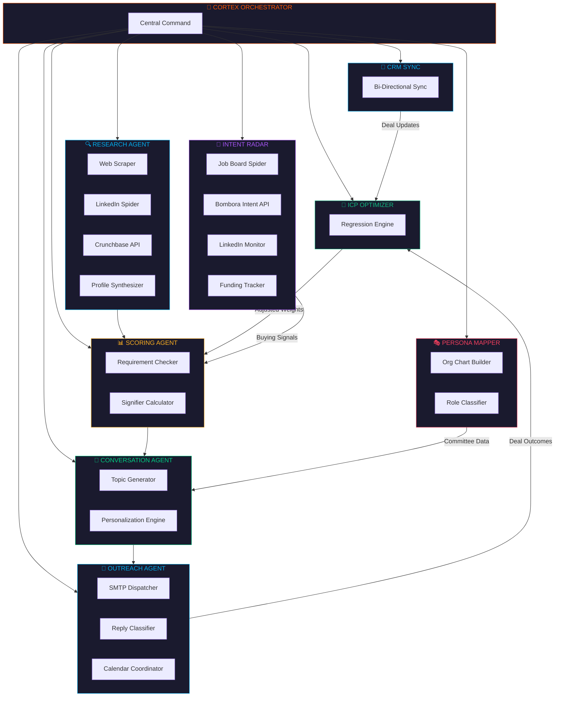
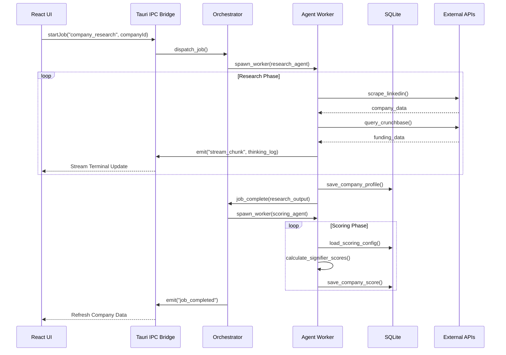

<div align="center">

<!-- Animated SVG Header -->


<br/>

<p>
  
  
  
  
  
  
</p>

<p>
  <strong>Replace your entire SDR team with autonomous AI agent swarms.</strong><br/>
  <sub>CortexOS is a desktop-native GTM intelligence platform that researches, scores, personalizes, and executes outbound — autonomously.</sub>
</p>

<br/>

[Features](#-features) · [Architecture](#-architecture) · [Quick Start](#-quick-start) · [Agent Swarm](#-the-agent-swarm) · [Pages](#-pages) · [Tech Stack](#-tech-stack) · [Roadmap](#-roadmap)

</div>

---

<br/>

## ⚡ What is CortexOS?

CortexOS is a **fully autonomous Go-To-Market operating system** built as a native desktop app. It deploys a swarm of specialized AI agents that work in concert to:

1. **Discover** target accounts from any data source
2. **Research** each company deeply via web scraping and LLM analysis
3. **Score** every account against your Ideal Customer Profile (ICP)
4. **Map** buying committees and assign persona-level roles
5. **Generate** hyper-personalized conversation starters
6. **Execute** multi-step outreach sequences autonomously
7. **Learn** from outcomes to continuously tune scoring weights
8. **Sync** everything bi-directionally with your CRM

> **Zero manual prospecting. Zero copy-paste. Zero SDR headcount.**

<br/>

---

## 🧠 Architecture

<!-- Animated SVG Architecture Diagram -->
<div align="center">


</div>

<br/>

---

## 🔥 Features

### 🏢 Company Intelligence Pipeline
- **Automated Research** — Web-scraping agents pull company data from LinkedIn, Crunchbase, and public sources
- **ICP Scoring** — Multi-dimensional scoring engine with weighted demand signifiers
- **Tiered Pipeline** — Automatic `Hot` → `Warm` → `Nurture` tiering with Kanban board view
- **Company Detail Pages** — Deep profiles with research output, score breakdown, and conversation topics

### 👥 Relationship & Persona Mapping
- **Buying Committee Visualization** — Contacts grouped by account with org-chart style layout
- **Persona Classification** — Auto-assigned roles: `Champion`, `Economic Buyer`, `Blocker`, `Influencer`, `End User`
- **Relationship Strength Scoring** — 0-100 heatbars tracking connection depth per contact

### 📡 Real-Time Intent Mesh
- **Radar Visualization** — SVG-based radar mapping signal density per account
- **Live Signal Feed** — Scrolling feed of detected buying signals (funding, hiring, leadership changes)
- **Trigger Actions** — One-click "Trigger Flow" to jump from signal → automated workflow

### 📧 Autonomous Outreach Engine
- **Multi-Step Sequences** — `Drafting` → `Sending` → `Tracking` → `Reply Classification` → `Meeting Booking`
- **Reply Intent Classification** — LLM-powered categorization: Interested, Objection, Referral, Not Now
- **Meeting Booking** — Autonomous calendar coordination
- **Deliverability Controls** — Daily send limits, warmup modes, follow-up delays

### 🧠 Self-Learning ICP Optimizer
- **Neural Feedback Loop** — Won/Lost deals automatically adjust scoring weights
- **Weight Visualization** — See exactly how each signifier weight changes over time
- **Emergent Insights** — System surfaces correlations humans would miss
- **Confidence Tracking** — Model confidence score improves with each feedback cycle

### 🔌 CRM / Ecosystem Sync
- **HubSpot, Salesforce, Pipedrive** — Connector cards with one-click auth
- **Field-Level Mapping** — CortexOS fields ↔ CRM properties with direction control
- **Bi-Directional Sync** — Push scored leads, pull deal stage updates
- **Sync History** — Timestamped audit log of every push/pull operation

### 👥 Multi-User Teams
- **Workspace Switcher** — Multiple workspaces per org (e.g., GTM, EMEA)
- **Role-Based Access** — Admin, Member, Viewer with agent allocation quotas
- **Team Presence** — Real-time online indicators in the header
- **Global Activity Feed** — Slide-out panel showing all team + agent actions

### 🔧 System Core
- **Visual Flow Builder** — Drag-and-drop workflow canvas (powered by XYFlow)
- **Memory Graph** — Force-directed knowledge graph visualization
- **Stream Terminal** — Real-time agent thought process viewer
- **Command Palette** — `Cmd+K` to search anything

<br/>

---

## 🤖 The Agent Swarm

CortexOS deploys **8 autonomous agents**, each with specialized worker pools:



<br/>

---

## 📄 Pages

| Route | Page | Description |
|-------|------|-------------|
| `/dashboard` | Command Center | KPI stat cards, sparklines, pipeline funnel, live activity feed |
| `/companies` | Companies | Full pipeline table with scoring tiers, Kanban board toggle |
| `/companies/:id` | Company Detail | Deep research profile, score breakdown, conversation topics |
| `/contacts` | Contacts & Buying Committees | List view + Buying Committee visualization with persona badges |
| `/contacts/:id` | Contact Detail | Individual contact profile with research and adjacency data |
| `/signals` | Intent Mesh | Radar visualization + live signal feed with trigger actions |
| `/outreach` | Outreach Command Center | Sequence timeline, reply cards, meeting cards |
| `/agents` | Agent Swarm | Deploy agents against targets, stream terminal viewer |
| `/icp` | ICP Optimizer | Self-learning feedback loop visualizer, emergent insights |
| `/integrations` | Integrations Hub | CRM connectors, field mapping, sync history |
| `/memory` | Memory Graph | Force-directed knowledge graph |
| `/flow` | Flow Builder | Visual drag-and-drop workflow canvas |
| `/settings` | Settings | Browser, orchestration, email, team management |

<br/>

---

## 🔄 GTM Execution Workflow

```mermaid
flowchart LR
    A["🌐 Data Sources"] -->|Scrape & Enrich| B["🔍 Research Agent"]
    B -->|Company Profiles| C["📊 Scoring Agent"]
    C -->|ICP Score + Tier| D{"Score > Threshold?"}
    D -->|❌ Nurture| E["📋 Nurture Queue"]
    D -->|✅ Hot/Warm| F["🎭 Persona Mapper"]
    F -->|Buying Committee| G["💬 Conversation Agent"]
    G -->|Personalized Copy| H["📧 Outreach Agent"]
    H -->|Sequences| I{"Reply?"}
    I -->|😊 Interested| J["📅 Meeting Booked"]
    I -->|🤔 Objection| K["🔄 Nurture + Retry"]
    I -->|❌ Rejected| L["🎯 ICP Optimizer"]
    J -->|Deal Won/Lost| L
    L -->|Weight Adjustment| C
    
    M["📡 Intent Radar"] -->|Buying Signals| C
    N["🔌 CRM Sync"] <-->|Bi-directional| H

    style A fill:#0a0a1a,stroke:#666,color:#ccc
    style B fill:#0a0a1a,stroke:#00AEEF,color:#00AEEF
    style C fill:#0a0a1a,stroke:#FFB020,color:#FFB020
    style D fill:#0a0a1a,stroke:#FF5500,color:#FF5500
    style E fill:#0a0a1a,stroke:#666,color:#888
    style F fill:#0a0a1a,stroke:#F43F5E,color:#F43F5E
    style G fill:#0a0a1a,stroke:#00D084,color:#00D084
    style H fill:#0a0a1a,stroke:#00AEEF,color:#00AEEF
    style I fill:#0a0a1a,stroke:#FF5500,color:#FF5500
    style J fill:#0a0a1a,stroke:#00D084,color:#00D084
    style K fill:#0a0a1a,stroke:#FFB020,color:#FFB020
    style L fill:#0a0a1a,stroke:#A855F7,color:#A855F7
    style M fill:#0a0a1a,stroke:#A855F7,color:#A855F7
    style N fill:#0a0a1a,stroke:#00AEEF,color:#00AEEF
```



<br/>

---

## 🚀 Quick Start

### Prerequisites
- [Node.js](https://nodejs.org/) v20+
- [Rust](https://rustup.rs/) (latest stable)
- [Tauri CLI](https://v2.tauri.app/start/prerequisites/)

### Installation

```bash
# Clone the repository
git clone https://github.com/DevChiniwala/CortexOS.git
cd CortexOS

# Install frontend dependencies
npm install

# Run in browser mode (no Rust required)
npm run dev

# Run as native desktop app (requires Rust)
npm run tauri:dev
```

> **💡 Browser Mode**: CortexOS runs fully in the browser using `localStorage` as a fallback persistence layer. No Rust/Tauri backend needed for development.

<br/>

---

## 🛠 Tech Stack

### Frontend
| Technology | Version | Purpose |
|-----------|---------|---------|
| **React** | 19.2 | UI Framework |
| **TypeScript** | 6.0 | Type Safety |
| **Tailwind CSS** | 4.2 | Utility-First Styling |
| **Vite** | 8.0 | Build Tool |
| **TanStack Query** | 5.96 | Server State + Cache |
| **Zustand** | 5.0 | Client State |
| **Motion** (Framer) | 12.38 | Animations |
| **XYFlow** | 12.11 | Flow Builder Canvas |
| **react-force-graph-2d** | 1.29 | Memory Graph |
| **Tabler Icons** | 3.41 | Icon System |
| **cmdk** | 1.1 | Command Palette |
| **date-fns** | 4.4 | Date Formatting |

### Backend
| Technology | Purpose |
|-----------|---------|
| **Tauri 2** | Native Desktop Runtime |
| **Rust** | Backend Logic + Orchestration |
| **SQLite** | Local Database |
| **Serde** | Serialization |

### Design System
| Token | Value | Usage |
|-------|-------|-------|
| `--ink` | `#E8E8ED` | Primary text |
| `--surface` | `#12121A` | Card backgrounds |
| `--bg` | `#0A0A0F` | Page background |
| `--primary` | `#FF5500` | Brand accent (CortexOS Orange) |
| `--info` | `#00AEEF` | Information, links |
| `--success` | `#00D084` | Positive states |
| `--warning` | `#FFB020` | Caution states |
| `--danger` | `#F43F5E` | Error states |

<br/>

---

## 📁 Project Structure

```
CortexOS/
├── src/
│   ├── pages/                    # 13 route pages
│   │   ├── dashboard.tsx         # KPI command center
│   │   ├── companies.tsx         # Pipeline table + kanban
│   │   ├── company-detail.tsx    # Deep company profile
│   │   ├── contacts.tsx          # Contacts + buying committees
│   │   ├── contact-detail.tsx    # Individual contact view
│   │   ├── signals.tsx           # Intent mesh + signal feed
│   │   ├── outreach.tsx          # Outreach command center
│   │   ├── agents.tsx            # Agent swarm dispatcher
│   │   ├── icp.tsx               # Self-learning ICP optimizer
│   │   ├── integrations.tsx      # CRM ecosystem sync
│   │   ├── memory.tsx            # Knowledge graph
│   │   ├── flow.tsx              # Visual flow builder
│   │   └── settings.tsx          # System configuration
│   │
│   ├── components/
│   │   ├── layout/               # Shell, sidebar, global activity
│   │   ├── ui/                   # Design system primitives
│   │   ├── dashboard/            # Activity feed, funnel chart
│   │   ├── contacts/             # Buying committee cards
│   │   ├── signals/              # Intent mesh, signal feed
│   │   ├── outreach/             # Reply cards, meeting cards
│   │   ├── scoring/              # ICP learning loop
│   │   ├── pipeline/             # Kanban board
│   │   ├── stream/               # Agent terminal viewer
│   │   ├── flow/                 # Flow canvas + nodes
│   │   ├── memory/               # Force graph
│   │   ├── modals/               # Add company/contact
│   │   └── onboarding/           # First-run wizard
│   │
│   ├── lib/
│   │   ├── hooks/                # React hooks (5 files)
│   │   ├── store/                # Zustand stores (5 files)
│   │   ├── ipc/                  # Tauri IPC wrappers
│   │   ├── sync/                 # Query cache + optimistic updates
│   │   ├── types/                # TypeScript interfaces
│   │   ├── local-store.ts        # Browser-mode persistence
│   │   ├── mock-data.ts          # Seed data (companies + contacts)
│   │   └── utils.ts              # Shared utilities
│   │
│   ├── App.tsx                   # Router + providers
│   ├── main.tsx                  # Entry point
│   └── globals.css               # Design tokens + base styles
│
├── src-tauri/                    # Rust backend
│   ├── src/
│   │   ├── commands/             # Tauri IPC command handlers
│   │   ├── db/                   # SQLite schema + queries
│   │   ├── orchestration/        # Agent orchestration engine
│   │   ├── prompts/              # LLM prompt templates
│   │   ├── memory/               # Knowledge graph engine
│   │   ├── hive/                 # Agent swarm coordinator
│   │   ├── signals/              # Signal detection pipeline
│   │   └── lib.rs                # Tauri app entry
│   └── Cargo.toml
│
├── package.json
├── tailwind.config.ts
├── vite.config.ts
└── tsconfig.json
```

<br/>

---

## 🧬 Data Flow



<br/>

---

## 🗺 Roadmap

- [x] **Phase 1-5** — Core Platform (Research, Scoring, Conversations, Flow Builder, Memory Graph)
- [x] **Phase 6** — Autonomous Outreach Execution
- [x] **Phase 7** — Real-Time Intent Mesh
- [x] **Phase 8** — Relationship & Persona Mapping
- [x] **Phase 9** — Self-Learning ICP Optimizer
- [x] **Phase 10** — Multi-User Teams & Global State
- [x] **Phase 11** — CRM / Ecosystem Sync
- [ ] **Phase 12** — Multi-Channel (LinkedIn, WhatsApp, SMS)
- [ ] **Phase 13** — Revenue Attribution & ROI Dashboard
- [ ] **Phase 14** — Custom Agent Builder (No-Code)
- [ ] **Phase 15** — Marketplace for Community Agents

<br/>

---

<div align="center">

<br/>


<br/>

<sub>Made by <a href="https://github.com/DevChiniwala">@DevChiniwala</a> · Licensed under MIT</sub>

</div>
