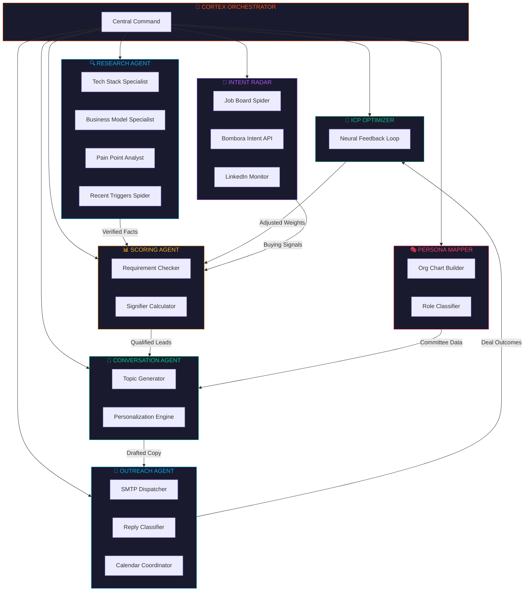

<div align="center">


<br/>

<p>
  
  
  
  
  
  
  
  
</p>

<p>
  <strong>Every AI sales tool hallucinates. CortexOS doesn't.</strong><br/>
  <sub>A 100% grounded, verifiable AI GTM platform with zero hallucinated facts. Replace your SDR team with an autonomous swarm that actually tells the truth.</sub>
</p>

</div>

---

<br/>

## ⚡ What is CortexOS?

The current generation of AI SDRs and sales tools all suffer from the same fatal flaw: **they make things up.** 
They generate company profiles with hallucinated technologies, assign fake titles to real people, and output arbitrary "Confidence: 99%" scores that have no basis in reality. When your outreach is based on a hallucination, you burn your domain reputation and look like a spammer.

**CortexOS is built on a fundamentally different premise: If an LLM says it, it must be verified against a source.** 

It deploys a swarm of specialized AI agents that work in concert to:
1. **Discover** target accounts from any data source.
2. **Research & Extract** claims via deep web scraping.
3. **Verify** every single claim against source HTML using a deterministic Rust pipeline.
4. **Score** every account against your Ideal Customer Profile (ICP) based *only* on verified facts.
5. **Execute** multi-step outreach sequences autonomously.

> **Zero manual prospecting. Zero copy-paste. Zero hallucinations.**

<br/>

---

## 🏗️ Architecture & Data Flow

CortexOS operates on a high-performance Rust backend connected to a bleeding-edge React 19 frontend via Tauri's IPC bridge.

<div align="center">
  <picture>
    <source media="(prefers-color-scheme: dark)" srcset="https://raw.githubusercontent.com/DevChiniwala/CortexOS/main/.github/assets/data-flow.svg">
    
  </picture>
</div>

<br/>

---

## 🛡️ The Verification Engine

Instead of letting an LLM write a summary from its latent knowledge, CortexOS runs a **3-Tier Verification Gauntlet**:

<div align="center">
  <picture>
    <source media="(prefers-color-scheme: dark)" srcset="https://raw.githubusercontent.com/DevChiniwala/CortexOS/main/.github/assets/verification-gauntlet.svg">
    
  </picture>
</div>

<br/>

- **The Gauntlet:** Claims extracted by the LLM are passed into a deterministic Rust engine which verifies them against the raw HTML of the source. It assigns a confidence tier based on the matching strictly: Exact Match (100%), Normalized Match (92%), and Fuzzy LCS (>80%). 
- **Corroboration Engine:** O(N²) deduplication merges identical claims found across *independent sources* (e.g., Tech Stack Agent and Business Model Agent both find the same metric). The UI displays a striking `"Confirmed by N sources"` pill.
- **The Trust Score:** Every generated profile is stamped with a deterministic Trust Score—the exact percentage of claims that were mathematically verified. 
- **The Evidence Tab:** In the UI, click on any generated claim to see exactly where it came from, highlighted on the original source URL.

<br/>

---

## 🤖 Agent Swarm

CortexOS deploys **8 autonomous agents**, each with specialized worker pools coordinated by a central orchestrator.

<div align="center">
  <picture>
    <source media="(prefers-color-scheme: dark)" srcset="https://raw.githubusercontent.com/DevChiniwala/CortexOS/main/.github/assets/architecture.svg">
    
  </picture>
</div>



<br/>

---

## ✨ Features

### 🏢 Verifiable Intelligence Pipeline
- **Automated Research** — Multi-agent swarm (Tech Stack, Business Model, Pain Points, Triggers) extracts intelligence from raw sources.
- **The Evidence Tab** — Every company profile surfaces the verbatim quotes, citations, and trust badges proving the facts.
- **Multi-Source Corroboration** — Visually see when independent sources verify the same intel.

### 🧠 Autonomous ICP Scoring
- **Automated Tiers** — Evaluate accounts against strict constraints (must pass) and weighted demand signifiers (Tier 1, 2, 3).
- **Self-Learning ICP Optimizer** — Neural feedback loop that adjusts scoring weights based on won/lost deals.

### 👥 Persona Mapping & Messaging
- **Buying Committee Visualization** — Auto-identifies `Champion`, `Economic Buyer`, `Blocker`, `End User`.
- **Relationship Strength Mapping** — Tracks depth of connection via a visual 0-100 heatbar.
- **Hyper-Personalization** — The Conversation Agent generates personalized outreach based *only* on verified facts and intent triggers.

### 🔀 Orchestration Rules Engine
- **Visual Flow Builder** — Drag-and-drop workflow canvas to compose custom agent pipelines using XYFlow. Fully executable.
- **Intent Mesh** — Live SVG radar mapping signal density per account (funding, hiring, tech stack changes).

### ⚡ Tauri Native App
- **Rust Performance** — Uses Tauri v2 to run completely locally, interfacing with APIs quickly via `tokio` multi-threading.
- **Zero-Latency Database** — Embedded SQLite store for instantaneous UI updates without cloud lag.

<br/>

---

## 🚀 Web App Views

*(Screenshots coming soon - Add your beautiful UI screenshots here to showcase the dashboard, pipeline, intent radar, and evidence tab!)*

<br/>

---

## 📄 Pages

| Route | Page | Description |
|-------|------|-------------|
| `/dashboard` | Command Center | KPI stat cards, sparklines, pipeline funnel, live activity feed |
| `/companies` | Companies | Full pipeline table with scoring tiers, Kanban board toggle |
| `/companies/:id` | Company Detail | Deep research profile, Evidence tab, Trust Score Ring, people mapped |
| `/contacts` | Contacts | List view + Buying Committee visualization with Persona Badges |
| `/signals` | Intent Mesh | Radar visualization + live signal feed with trigger actions |
| `/outreach` | Outreach Command | Sequence timeline, reply cards, meeting tracking |
| `/agents` | Agent Swarm | Deploy agents against targets, stream terminal viewer |
| `/icp` | ICP Optimizer | Self-learning feedback loop visualizer, emergent insights |
| `/flow` | Flow Builder | Visual drag-and-drop workflow canvas (Fully Executable) |
| `/settings` | Settings | LLM Keys, orchestration, email, CRM sync |

<br/>

---

## 🔄 GTM Execution Workflow

Assemble your pipelines visually using the **Cortex Flow Builder**, and execute them entirely autonomously.

```mermaid
flowchart LR
    A["🌐 Data Sources"] -->|Scrape & Enrich| B["🔍 Research Pipeline"]
    B -->|Verified Profiles| C["📊 Scoring Engine"]
    C -->|ICP Score + Tier| D{"Score > Threshold?"}
    D -->|❌ Low| E["📋 Nurture Queue"]
    D -->|✅ High| F["🎭 Persona Mapper"]
    F -->|Buying Committee| G["💬 Conversation Agent"]
    G -->|Personalized Copy| H["📧 Outreach Flow"]
    H -->|Sequences| I{"Reply Intent?"}
    I -->|😊 Interested| J["📅 Meeting Booked"]
    I -->|🤔 Objection| K["🔄 Handle & Nurture"]
    I -->|❌ Rejected| L["🎯 ICP Optimizer"]
    J -->|Deal Won/Lost| L
    L -->|Weight Adjustment| C
    
    M["📡 Intent Radar"] -.->|Buying Signals| C

    style A fill:#0a0a1a,stroke:#666,color:#ccc
    style B fill:#001a33,stroke:#00AEEF,color:#00AEEF
    style C fill:#332200,stroke:#FFB020,color:#FFB020
    style D fill:#331100,stroke:#FF5500,color:#FF5500
    style E fill:#1a1a1a,stroke:#666,color:#888
    style F fill:#33001a,stroke:#F43F5E,color:#F43F5E
    style G fill:#00331a,stroke:#00D084,color:#00D084
    style H fill:#1a0033,stroke:#A855F7,color:#A855F7
    style I fill:#331100,stroke:#FF5500,color:#FF5500
    style J fill:#00331a,stroke:#00D084,color:#00D084
    style K fill:#332200,stroke:#FFB020,color:#FFB020
    style L fill:#1a2b22,stroke:#10B981,color:#10B981
    style M fill:#1a0033,stroke:#A855F7,color:#A855F7
```



<br/>

---

## 💻 Tech Stack

### Frontend
- **React 19**
- **Vite**
- **Tailwind CSS v4**
- **Zustand** (Global State)
- **TanStack Query v5** (Data Sync & Cache)
- **Motion (Framer)** (Animations)
- **XYFlow / React** (Visual Builder)
- **Recharts** (Data Visualization)
- **D3 / Force-Graph** (Memory Graph)

### Backend (Tauri Core)
- **Rust**
- **Tauri v2**
- **Tokio** (Async Runtime)
- **Rusqlite** (Local Database)

### Intelligence APIs
- **Google Gemini 2.5 Flash** (Extractor LLM)
- **Tavily** (Search & HTML scraping)
- **Apollo** (People Data)
- **Bombora** (Intent Signals)

<br/>

---

## 🗄️ Database

CortexOS uses a local `SQLite` database embedded in the Tauri backend for zero-latency operations.

| Table | Details |
|-------|---------|
| `companies` | Target accounts, ICP scores, firmographics, and Trust Score metrics |
| `contacts` | Buying committee members, personas, and relationship strength |
| `signals` | Intent signals (funding, hiring, tech stack changes) tied to companies |
| `outreach` | Conversation sequences, generated copy, and reply status |
| `settings` | API keys, LLM preferences, and orchestration configurations |

<br/>

---

## 📂 Project Structure

```bash
📂 CortexOS
 ┣ 📂 .github
 ┃ ┗ 📂 assets                  # SVG assets, diagrams, and branding
 ┣ 📂 src-tauri                 # Rust Backend (Tauri)
 ┃ ┣ 📄 Cargo.toml              # Rust dependencies
 ┃ ┣ 📄 build.rs                # Tauri build script
 ┃ ┗ 📂 src
 ┃   ┣ 📄 main.rs               # App entry point
 ┃   ┣ 📄 lib.rs                # Command registry and setup
 ┃   ┣ 📂 agents                # Autonomous agent logic (Researcher, Scorer, etc.)
 ┃   ┣ 📂 commands              # IPC commands exposed to React
 ┃   ┣ 📂 core                  # Core engines (LLM, Tavily, Verification, Flow Executor)
 ┃   ┣ 📂 db                    # SQLite schema, queries, and state management
 ┃   ┣ 📂 hive                  # Swarm orchestration and agent messaging
 ┃   ┗ 📂 prompts               # System prompts and agent instructions
 ┣ 📂 src                       # React Frontend
 ┃ ┣ 📄 App.tsx                 # Routing definition
 ┃ ┣ 📄 globals.css             # Tailwind configuration and design system tokens
 ┃ ┣ 📂 components              # UI Component Library
 ┃ ┃ ┣ 📂 flow                  # XYFlow canvas and nodes
 ┃ ┃ ┣ 📂 ui                    # Reusable primitives (Buttons, Cards, TrustBadges)
 ┃ ┃ ┣ 📂 layout                # Sidebar, MainShell, Command Palette
 ┃ ┃ ┗ 📂 ...                   # Feature-specific components (Outreach, Scoring)
 ┃ ┣ 📂 lib                     # Utilities and State
 ┃ ┃ ┣ 📂 ipc                   # Event bridge and Tauri invoke() wrappers
 ┃ ┃ ┣ 📂 store                 # Zustand state stores
 ┃ ┃ ┗ 📂 sync                  # TanStack query clients and optimisic updates
 ┃ ┗ 📂 pages                   # Application Views (Dashboard, Companies, Signals, etc.)
 ┗ 📄 package.json              # Node dependencies and scripts
```

<br/>

---

## 🗺️ Roadmap

- [x] Phase 1: Core Research Pipeline (Tavily + Extractors)
- [x] Phase 2: React 19 + Tauri 2 Foundation
- [x] Phase 3: The 3-Tier Verification Gauntlet (Rust Engine)
- [x] Phase 4: Intent Signals & Demand Radar
- [x] Phase 5: XYFlow Visual Builder
- [ ] Phase 6: Automated Email Dispatch (SMTP/IMAP integrations)
- [ ] Phase 7: HubSpot & Salesforce Bi-Directional Sync
- [ ] Phase 8: Cloud-Hosted Orchestration (Vercel/AWS)

<br/>

---

<div align="center">
  
</div>
