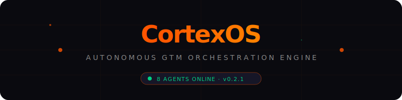
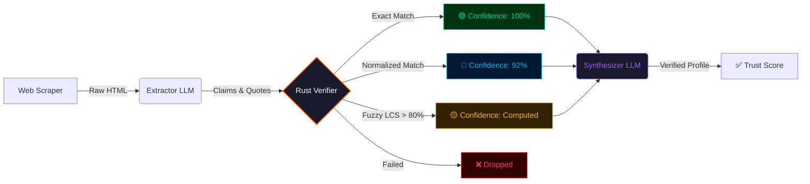
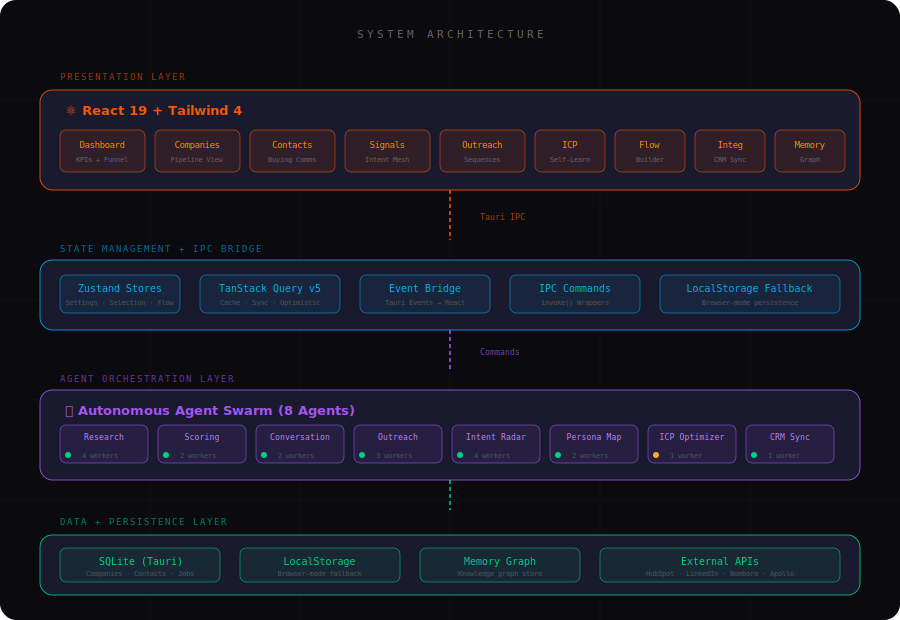
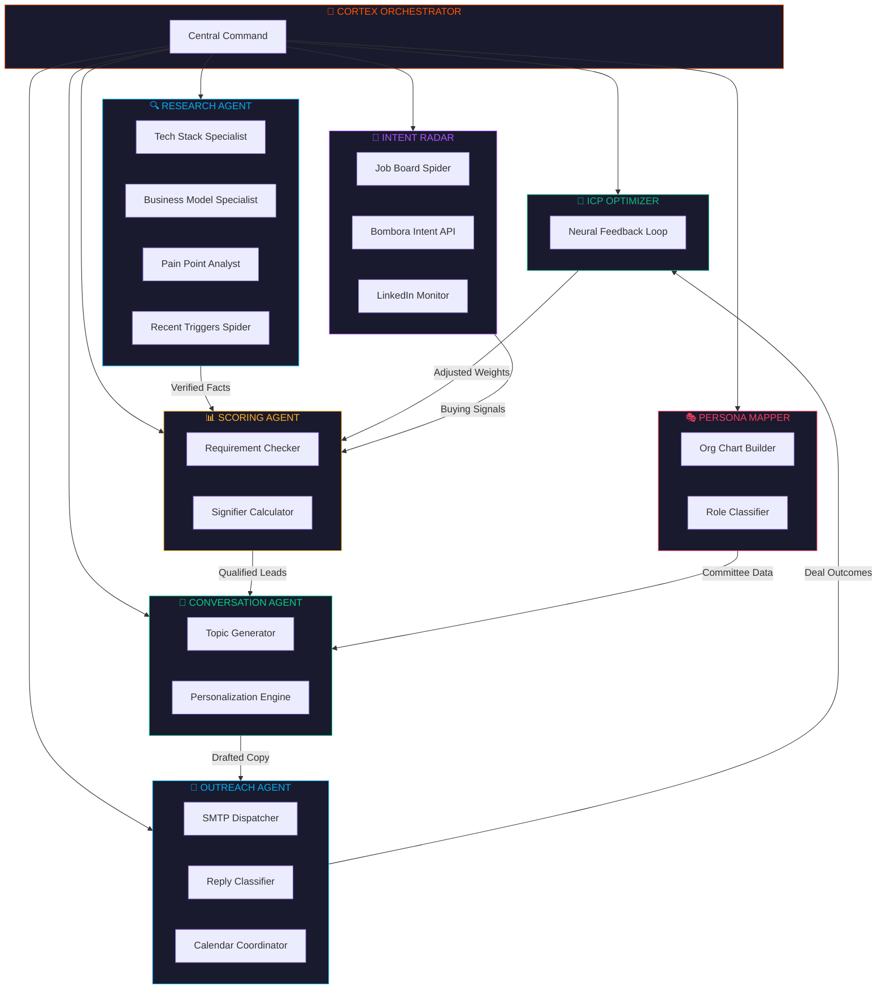

<div align="center">

<!-- Animated SVG Header -->


<br/>

<p>
  
  
  
  
  
  
</p>

<p>
  <strong>Every AI sales tool hallucinates. CortexOS doesn't.</strong><br/>
  <sub>A 100% grounded, verifiable AI GTM platform with zero hallucinated facts. Replace your SDR team with an autonomous swarm that actually tells the truth.</sub>
</p>

<br/>

[Features](#-features) · [The Verification Engine](#-the-verification-engine) · [Agent Swarm](#-the-agent-swarm) · [GTM Workflow](#-gtm-execution-workflow) · [Pages](#-pages) · [Quick Start](#-quick-start)

</div>

---

<br/>

## ⚡ What is CortexOS?

The current generation of AI SDRs and sales tools all suffer from the same fatal flaw: **they make things up.** 
They generate company profiles with hallucinated technologies, assign fake titles to real people, and output arbitrary "Confidence: 99%" scores that have no basis in reality. When your outreach is based on a hallucination, you burn your domain reputation and look like a spammer.

**CortexOS is built on a fundamentally different premise: If an LLM says it, it must be verified against a source.** 

It deploys a swarm of specialized AI agents that work in concert to:
1. **Discover** target accounts from any data source.
2. **Research & Extract** claims via deep web scraping.
3. **Verify** every single claim against source HTML using a deterministic Rust pipeline.
4. **Score** every account against your Ideal Customer Profile (ICP) based *only* on verified facts.
5. **Execute** multi-step outreach sequences autonomously.

> **Zero manual prospecting. Zero copy-paste. Zero hallucinations.**

<br/>

---

## 🛡️ The Verification Engine

Instead of letting an LLM write a summary from its latent knowledge, CortexOS runs a **3-Tier Verification Gauntlet**:



- **Corroboration:** When independent sources confirm the same fact, the engine merges them into a single corroborated claim (e.g. *"Confirmed by 3 sources"*).
- **The Trust Score:** Every generated profile is stamped with a deterministic Trust Score—the exact percentage of claims that were mathematically verified. 

<br/>

---

## 🧠 Architecture & Agent Swarm

CortexOS deploys **8 autonomous agents**, each with specialized worker pools coordinated by a central orchestrator.

<div align="center">
  
</div>

<br/>



<br/>

---

## 🔄 GTM Execution Workflow

Assemble your pipelines visually using the **Cortex Flow Builder**, and execute them entirely autonomously.

```mermaid
flowchart LR
    A["🌐 Data Sources"] -->|Scrape & Enrich| B["🔍 Research Pipeline"]
    B -->|Verified Profiles| C["📊 Scoring Engine"]
    C -->|ICP Score + Tier| D{"Score > Threshold?"}
    D -->|❌ Low| E["📋 Nurture Queue"]
    D -->|✅ High| F["🎭 Persona Mapper"]
    F -->|Buying Committee| G["💬 Conversation Agent"]
    G -->|Personalized Copy| H["📧 Outreach Flow"]
    H -->|Sequences| I{"Reply Intent?"}
    I -->|😊 Interested| J["📅 Meeting Booked"]
    I -->|🤔 Objection| K["🔄 Handle & Nurture"]
    I -->|❌ Rejected| L["🎯 ICP Optimizer"]
    J -->|Deal Won/Lost| L
    L -->|Weight Adjustment| C
    
    M["📡 Intent Radar"] -.->|Buying Signals| C

    style A fill:#0a0a1a,stroke:#666,color:#ccc
    style B fill:#001a33,stroke:#00AEEF,color:#00AEEF
    style C fill:#332200,stroke:#FFB020,color:#FFB020
    style D fill:#331100,stroke:#FF5500,color:#FF5500
    style E fill:#1a1a1a,stroke:#666,color:#888
    style F fill:#33001a,stroke:#F43F5E,color:#F43F5E
    style G fill:#00331a,stroke:#00D084,color:#00D084
    style H fill:#1a0033,stroke:#A855F7,color:#A855F7
    style I fill:#331100,stroke:#FF5500,color:#FF5500
    style J fill:#00331a,stroke:#00D084,color:#00D084
    style K fill:#332200,stroke:#FFB020,color:#FFB020
    style L fill:#1a2b22,stroke:#10B981,color:#10B981
    style M fill:#1a0033,stroke:#A855F7,color:#A855F7
```



<br/>

---

## 🔥 Features

### 🏢 Verifiable Intelligence Pipeline
- **Automated Research** — Multi-agent swarm (Tech Stack, Business Model, Pain Points, Triggers).
- **The Evidence Tab** — Every company profile surfaces the verbatim quotes, citations, and trust badges proving the facts.
- **Multi-Source Corroboration** — Visually see when independent sources verify the same intel.
- **ICP Scoring** — Evaluate accounts against strict constraints (must pass) and weighted demand signifiers.

### 👥 Persona Mapping
- **Buying Committee Visualization** — Auto-identifies `Champion`, `Economic Buyer`, `Blocker`, `End User`.
- **Relationship Strength Mapping** — Tracks depth of connection via a visual 0-100 heatbar.

### 🧠 Advanced Control & Automation
- **Visual Flow Builder** — Drag-and-drop workflow canvas to compose custom agent pipelines.
- **Self-Learning ICP Optimizer** — Neural feedback loop that adjusts scoring weights based on won/lost deals.
- **Intent Mesh** — Live SVG radar mapping signal density per account (funding, hiring, tech stack changes).
- **Stream Terminal** — See the AI's internal thought process and HTTP requests streaming in real-time.

<br/>

---

## 📄 Pages

| Route | Page | Description |
|-------|------|-------------|
| `/dashboard` | Command Center | KPI stat cards, sparklines, pipeline funnel, live activity feed |
| `/companies` | Companies | Full pipeline table with scoring tiers, Kanban board toggle |
| `/companies/:id` | Company Detail | Deep research profile, Evidence tab, Trust Score Ring, people mapped |
| `/contacts` | Contacts | List view + Buying Committee visualization with Persona Badges |
| `/signals` | Intent Mesh | Radar visualization + live signal feed with trigger actions |
| `/outreach` | Outreach Command | Sequence timeline, reply cards, meeting tracking |
| `/agents` | Agent Swarm | Deploy agents against targets, stream terminal viewer |
| `/icp` | ICP Optimizer | Self-learning feedback loop visualizer, emergent insights |
| `/flow` | Flow Builder | Visual drag-and-drop workflow canvas (Fully Executable) |
| `/settings` | Settings | LLM Keys, orchestration, email, CRM sync |

<br/>

---

## 💻 Tech Stack

- **Frontend:** React 19, Vite, Tailwind CSS v4, Motion (Framer), Zustand, @xyflow/react
- **Backend:** Rust, Tauri 2, SQLite
- **Intelligence:** LLMs (Google Gemini 2.5 Flash), Web Search (Tavily), Custom Grounding Engine
- **UI Architecture:** Custom Dark Glassmorphism, Radix Primitives

<br/>

---

## 🚀 Quick Start

Get CortexOS running locally in 4 commands:

```bash
# 1. Clone the repository
git clone https://github.com/yourusername/CortexOS.git
cd CortexOS

# 2. Install dependencies
npm install

# 3. Setup Environment Variables
cp .env.example .env
# Add your GEMINI_API_KEY and TAVILY_API_KEY to .env

# 4. Start the development server
npm run tauri dev
```

<br/>

<div align="center">
  
</div>
